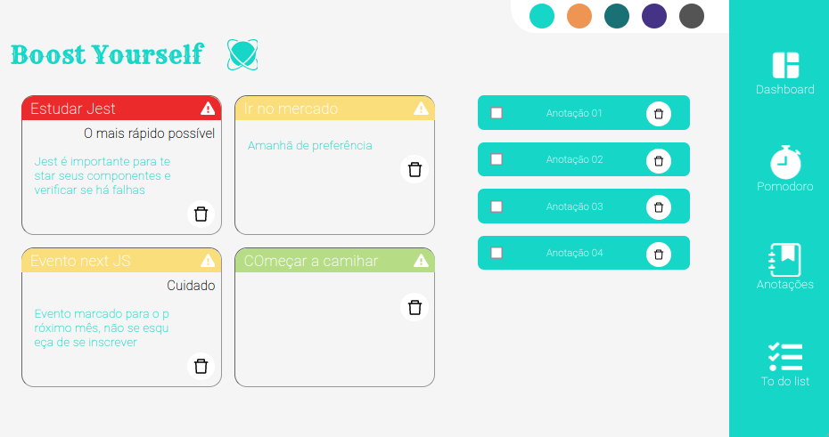
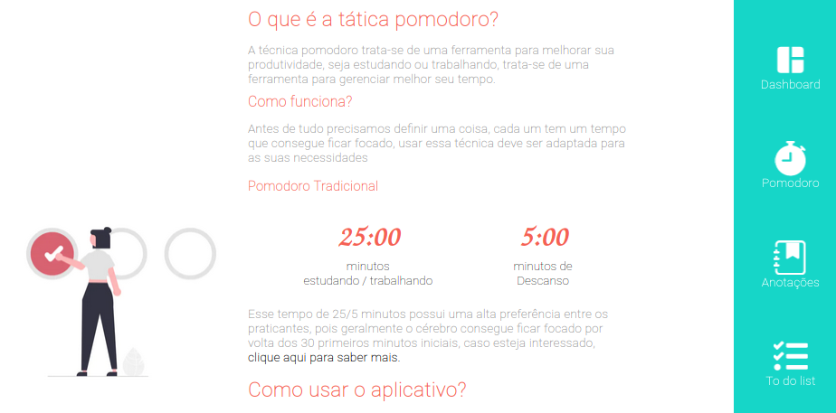

<center>
    <h1>Boost Yourself</h1>
    <h3>Uma aplicação focada na produtividade do dia a dia</h3>
    
</center>

<center>
    <h2><bold>Status do projeto:</bold></h2>
    <h3>Finalizado ☑️ </h3>
</center>

<h2><bold>Funcionalidades</bold></h2>

- Criação de pequenas notas com título, subtítulo e texto
- Criação de pequenas tarefas
- Pomodoro

<h3>Tecnologias</h3>

- Criação feita em next.js
- Typescript
- Redux
- Context API

<h3>Configuração</h3>

- Prettier
- ESLint
- Yarn

<h3>Como rodar o projeto?</h3>

Para rodar em sua máquina local, certifique-se de possuir o nodeJS instalado na máquina, assim como yarn (porém não é obrigatório), caso você prefira o pacote npm, da para usá-lo também. 

Basta baixá-lo como .zip ou dar um fork do projeto e clonar para seu repositório. 
Ao baixar o repositório, abra-o na sua IDE e navegue até o terminal e rode o seuginte comando:
```
yarn
```

Este comando baixará as dependências do projeto, como bibliotecas e configurações.

Caso esteja usando npm, troque o comando yarn por 

```
npm install 
```

<h3>Há outra forma de acessar o projeto?</h3>

Caso você queira apenas visualizar, e não tme pretensão de modificá-lo, ele está hospedado na plataforma vercel, para abrí-lo, basta <a href="https://boost-yourself.vercel.app/" target=_blank>clicar aqui</a>

<h2>Como funciona o projeto?</h2>

Este projeto foi desenvolvido com redux, e para explicá-lo vamos dividir as funcionalidades:

- Troca de cor dinâmica:

Foi criado uma store, e dentro dela um <i>reducer</i> chamado `changeGlobalColor` ele armazena um cóidigo de cor hexadecimal, e caso você acesse este caminho: `src/components/ColorTheme/index.tsx` verá o seguinte trecho de código: 

```
const dispatch = useDispatch()

  const changeColor = (color: string) => {
    return dispatch(changeGlobalColor(color))
  }

```

changeGlobalColor é uma action do redux criada para pegar o valor passado e mandá-lo para o reducer, os botões chamam essa função ao serem clicados:

```

<S.btnColor
    color={'#ee9554'}
    onClick={(e: MouseEvent) => changeColor('#ee9554')}
/>

```

E caso esteja se perguntando o que é esse color={} basicamente é uma propriedade que foi passada para o componente visual, lembre-se que o projeto foi desenvolvido junto com <i>styled components</i> e para não criar um botão para cada cor, foi criado um botão universal, que recebe `background-color` via props: 

```
export const btnColor = styled.button`
  width: 40px;
  height: 40px;
  border-radius: 50%;
  border: 1px solid transparent;
  background-color: ${(props) => props.color};
  transition: all 0.8s;
  cursor: pointer;
  &:hover {
    filter: brightness(0.8);
    border-color: black;
  }
`
```

- Criação de tarefas: 

Para aqui também foi criado um reducer próprio, que recebe o valor do  textarea e o manda para o reducer:

Caminho: `src/store/getCard/getCard.actions.ts`

```

export function addTask(textInput: string, id: string) {
    return {
        type: 'ADDTASK',
        payload: { textInput, id }
    }
}

export function removeTask(id: string | undefined) {
    return {
        type: 'REMOVETASK',
        payload: id
    }
}
```

Como você pode perceber, há duas funções, uma adiciona (simplismente repassa o valor digitado no textarea) e repassa no <i>payload</i> junto com um id específico, criado com a biblioteca `uiid` é uma boa biblioteca, pois ela cria <i>id's</i> diferentes para componente criado, evitando comflitos de `key` no react.
Segue como foi criado a função de criar nota:

```
onClick={(e: MouseEvent) => {
    if (textAreaValue.length > 0) {
        textInput = textAreaValue
        dispatch(addTask(textInput, id))
    }
}}
```

O mesmo conceito foi aplicado para criar anotação, com a diferença que um card de anotação recebe mais `props`, então o que foi passado para a <i>action</i> do reducer foi um objeto data, com todas as informações necessárias. Deve-se ficar atento a isso, pois ao mandar um objeto, a tipagem no reducer é alterada.

<center>

</center>

Na página pomodoro há uma breve explicação de como usá-lo, porém é super intuitivo de usar, conta com um alarme sonoro ao finalizar a tarefa.

Esse projeto foi desenvolvido usando next.JS e typescript, caso acha algum bug ou pense em alguma forma de melhorar, me avise, seja por aqui no github, ou no <a href="https://www.linkedin.com/in/guilherme-santos-coelho-1b7036210/" target="_blank">linkedin</a>

Foi desenvolvido com todo carinho e esforço, espero que tenha curtido 🙂

Te vejo no próximo grande projeto 😉
    